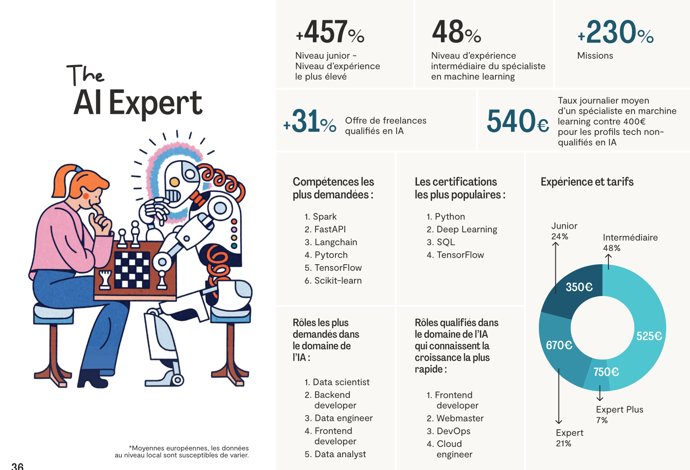

# Cahier des charges – SkillPath.ai (MVP simplifié)

## 1. Vision

**SkillPath.ai** est une plateforme de progression de carrière personnalisée à destination des développeurs. Elle génère des parcours d’apprentissage sur-mesure en fonction du profil technique, des préférences et des aspirations du développeur, tout en s’appuyant sur les tendances réelles du marché freelance et salarié.

La plateforme propose :

* Un **profil cible réaliste** à viser,
* Un **parcours progressif basé sur des projets concrets**,
* Une **interface pour suivre sa progression, valider les étapes et structurer ses apprentissages**.

L’objectif est d’apporter une direction claire, de la visibilité sur les opportunités réelles, et des actions concrètes à forte valeur.

## 2. Fonctionnalités du MVP

### 2.1 Formulaire ou chatbot intelligent

L’utilisateur renseigne :

* Son stack et niveau actuel
* Ses points forts (ex : autonomie, code structuré)
* Ses préférences (missions longues, remote, IA, etc.)
* Son objectif (évolution, spécialisation, montée en TJM)
* Son temps disponible et contraintes
* D'autres informations qu'il souhaite partager

Cela peut se faire via :

* Un formulaire structuré (type Streamlit)
* Ou un mini chatbot (via prompt et FastAPI). Perso je préfère ce choix simplement pour l'aspect IA/montée en compétence personnelle.

### 2.2 Génération d’un **profil cible**

L’outil renvoie :

* Un **rôle recommandé** (ex : “AI Automation Engineer”)
* Les **compétences clés** à acquérir
* Le **TJM moyen** observé
* Le **temps estimé** pour atteindre ce profil
* Une **stack technique recommandée**
* Des types de missions ou cas d’usage possibles
* **(Optionnel)** Une infographie ou visuel de profil cible

Exemple (plus ou moins mais j'avais que ça sous la main):

### 2.3 Génération d’un **parcours d’apprentissage**

Le parcours est structuré :

* En **étapes claires** à valider
* Avec :

  * Objectif par étape
  * Concepts ou technos à apprendre
  * Projet à construire
  * Durée estimée
  * Sources (docs, tutos, projets GitHub, etc.)
  * Checkbox "validé"

---

## 3. Deux options de rendu

| Option                                                 | Description                                                                                                                                  |
| ------------------------------------------------------ | -------------------------------------------------------------------------------------------------------------------------------------------- |
| **Option A – Site web simple**                         | Le parcours est affiché dans une interface (Streamlit ou Next.js) où l’utilisateur peut suivre les étapes, cocher, accéder aux ressources    |
| **Option B – Document PDF ou Markdown téléchargeable** | Le parcours et le profil sont générés comme un fichier structuré (`.pdf`, `.md` ou `.html`) et proposé au téléchargement ou envoyé par email |

---

## 4. Stack technique recommandée (chatGPT, j'ai pas trop challengé)

Alignée avec ton profil et les technos que tu veux pratiquer.

| Besoin                      | Stack recommandée                                          |
| --------------------------- | ---------------------------------------------------------- |
| Interface (formulaire/chat) | **Streamlit** (MVP rapide) ou FastAPI UI                   |
| Backend IA / génération     | **FastAPI + OpenAI API + Langchain**                       |
| Représentation de données   | Pydantic + SQLModel                                        |
| Stockage                    | SQLite (MVP local) ou PostgreSQL (hébergé)                 |
| Fichier export              | Génération `.md`, `.pdf`, `.html` via Jinja2 or WeasyPrint |
| Visuel de profil            | Placeholder image ou génération statique                   |
| Automatisation (plus tard)  | **n8n**                                                    |

---

## 5. Pages (si option site web retenue)

| Page        | Fonction                               |
| ----------- | -------------------------------------- |
| `/start`    | Formulaire ou chatbot                  |
| `/profile`  | Résumé du profil cible généré          |
| `/roadmap`  | Parcours en étapes avec cases à cocher |
| `/download` | Fichier exportable (Markdown ou PDF)   |

---

## 6. Contenus & données à structurer

* **Corpus d’exemples de profils cibles types**, pour entraîner et calibrer l’IA (ex : "Dev Data IA", "Dev Backend Clean Code", etc.)
* Liste de **compétences clés** et stacks associées par type de profil
* Données de référence sur les **tendances du marché freelance et salariat** (Malt, Comet, GitHub Trends, StackOverflow Jobs, etc.)
* 10 à 20 **étapes-types d’apprentissage** (concepts, technos, mini-projets) à combiner dynamiquement dans un parcours
* Templates pour générer automatiquement le parcours en `.md`, `.pdf`, ou `.html` avec visuels

---